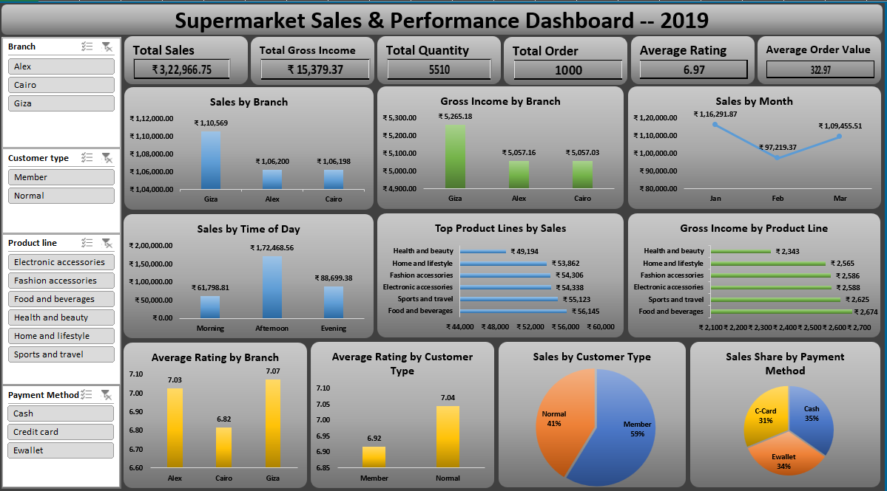

📊 Supermarket Sales Dashboard – Excel Project

📝 Project Overview

This project analyzes supermarket sales data to uncover insights about revenue, product performance, and customer behavior. The workflow includes raw data cleaning, PivotTables, and an interactive Excel dashboard that tracks key business KPIs.

🎯 Problem Statement

Supermarkets generate large volumes of sales data daily, but managers often lack quick visibility into performance metrics. This project builds an Excel dashboard to:

Track sales trends

Monitor branch-wise performance

Identify top-selling products

Understand customer purchasing behavior

📌 Objectives & KPIs

Total Sales Revenue

Average Sales per Transaction

Top Performing Products

Branch-wise Sales Comparison

Monthly Sales Trends

Gross Margin %

🔑 Key Insights (from data)

✔️ Giza branch generated the highest revenue, followed by Alex and Cairo.

✔️ Female customers contributed more revenue compared to male customers.

✔️ The top product line by revenue was Food and Beverages, followed closely by Sports and Travel and Electronic Accessories.

✔️ Saturday recorded the highest sales, confirming that weekends drive more business.

📂 Project Structure
Supermarket_Sales_Dashboard.xlsx

│

├── raw_data        → Original dataset  
├── clean_data      → Cleaned dataset  
├── pivot_tables    → PivotTables for KPI calculation  
└── Dashboard       → Final dashboard with KPIs & charts  

📸 Dashboard Preview

🚀 Tools & Techniques Used

Excel → PivotTables, PivotCharts, Slicers, Conditional Formatting

Data Cleaning → Removed duplicates, handled missing values

Dashboard Design → KPI cards, trend analysis, and interactive filtering

📈 Final Outcome

The dashboard provides supermarket management with a one-page interactive view of sales performance, helping them monitor KPIs effectively and make data-driven decisions.

