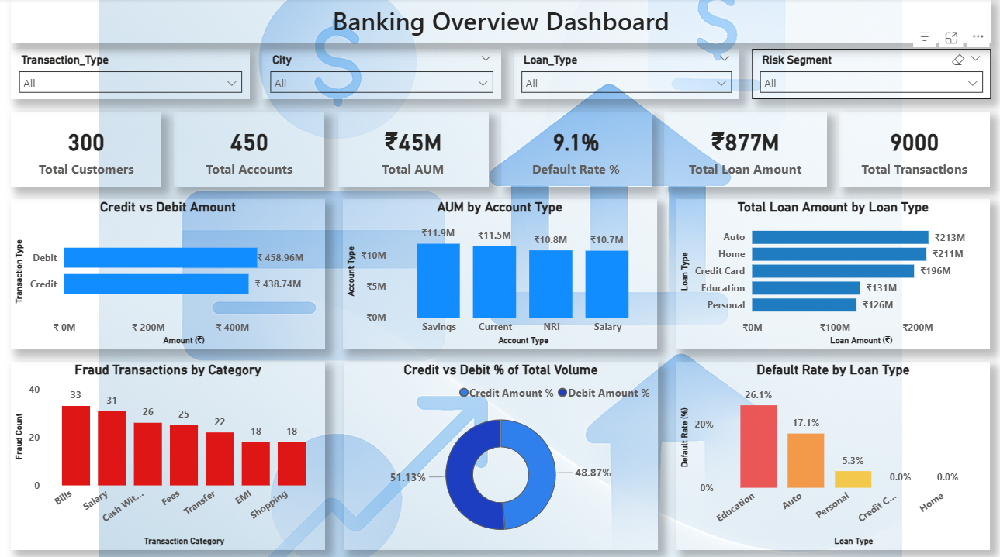
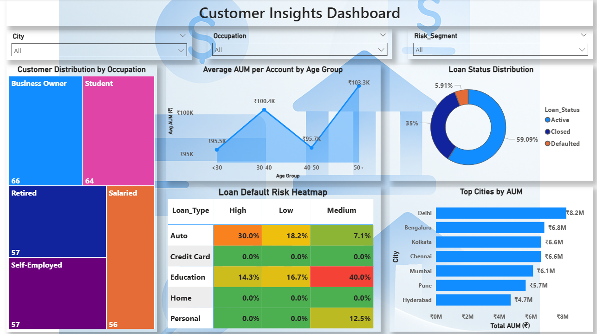

# 🏦 Banking Analytics Dashboard - Power BI

---

## 📌 Project Overview
This project analyzes banking data to understand **customer behavior, account performance, loan trends, transaction activity, and risk patterns**.  
Using Power BI, interactive dashboards were designed to provide decision-makers with a clear and structured view of banking operations, customer segmentation, and loan risk.

The dashboards are built with a focus on **data accuracy, correct business logic, and meaningful insights**, following real-world banking analytics practices.

---

## ❓ Problem Statement
This project analyzes bank customers, their accounts, loans, and transactions 
to understand customer behavior, evaluate financial performance, 
and identify risks such as loan defaults and potential fraud, supporting better data-driven decision-making.

---

## Dataset Description
The project uses multiple interconnected datasets that represent real-world banking operations:

- **Customers**
  - Demographic details (age, city, occupation)
  - Risk segment and customer profile

- **Accounts**
  - Account type
  - Average balance (used as AUM proxy)
  - Account age and status

- **Loans**
  - Loan type (Home, Auto, Education, Credit Card)
  - Loan amount
  - Loan status and default information

- **Transactions**
  - Credit and debit transactions
  - Transaction category and channel
  - Fraud indicator flag

**Key Assumptions**
- A customer can have multiple accounts.
- A customer can have multiple loans.
- Transactions are linked to accounts.
- Loans are modeled at the customer level.

---

## 🧩 Data Modelling
- One-to-many relationships were created between:
  - Customers → Accounts
  - Customers → Loans
  - Accounts → Transactions
- Customer-level attributes are used as global slicers to ensure consistent filtering across dashboards.
- Account-level and transaction-level attributes are used only where they logically apply.

This approach avoids ambiguous filtering and ensures analytical correctness.

---

## Objectives and KPIs

### 🎯 Objectives
- Analyze Assets Under Management (AUM)
- Monitor loan performance and default risk
- Understand customer behavior and segmentation
- Identify transaction trends and fraud-prone areas

### 📊 Key KPIs
- Total Customers
- Total Accounts
- Total AUM
- Total Loan Amount
- Default Rate (%)
- Total Transactions

---

## Dashboard Structure

### Page 1: Banking Overview Dashboard
Focuses on overall banking performance and operational metrics.

**Key Visuals**
- KPI Cards for high-level performance indicators
- Credit vs Debit Amount analysis
- AUM distribution by account type
- Loan amount by loan type
- Fraud transactions by category
- Default rate by loan type
- Credit vs Debit Transaction Volume

**Purpose**
To provide management with a quick overview of financial performance, loan exposure, transaction behavior, and risk areas.

---

### Page 2: Customer Insights Dashboard
Focuses on customer segmentation, wealth behavior, and loan risk.

**Key Visuals**
- Customer distribution by occupation (Tree Map)
- Average AUM per account by age group (Line Chart)
- Loan status distribution
- Loan default risk heatmap (Risk Segment × Loan Type)
- Top cities by AUM

**Purpose**
To understand who the customers are, how they behave financially, and where credit risk is concentrated.

---

## Key Insights
- Certain loan types show higher default risk
- Risk segments strongly influence loan performance
- A small number of cities contribute a large share of AUM
- Fraud activity is concentrated in specific transaction categories
- Older age groups generally hold higher average balances

---

## Project Structure
Banking-Analytics-PowerBI/

│

├──Dataset/

│ ├──customers.csv

│ ├──accounts.csv

│ ├──loans.csv

│ └──transactions.csv

│

├──Project_file/

│ └──Banking_Analytics_Dashboard.pbix

│

├──Images/

│ ├──Banking_Overview.png

│ └──Customer_Insights.png

│

└──README.md

---

## 📷 Dashboard Preview
### 1️⃣ Banking Overview Dashboard

### 2️⃣ Customer Insights Dashboard

---

## Tools & Technology
- **Power BI Desktop** – Data modeling and dashboard creation
- **Power Query** – Data cleaning and transformation
- **DAX** – Measures and KPIs

---

## Final Outcome
This project demonstrates the ability to analyze banking data using Power BI build interactive dashboards, and generate meaningful insights related to customer behavior, financial performance, and risk.  
It reflects real-world banking analytics use cases and supports data-driven decision-making.
