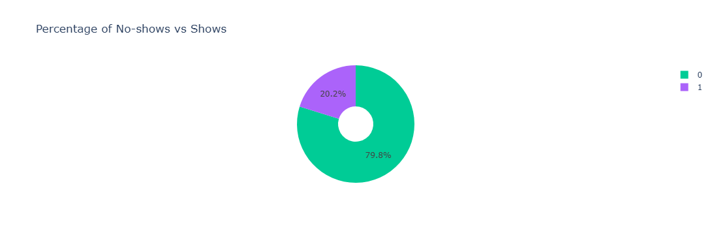
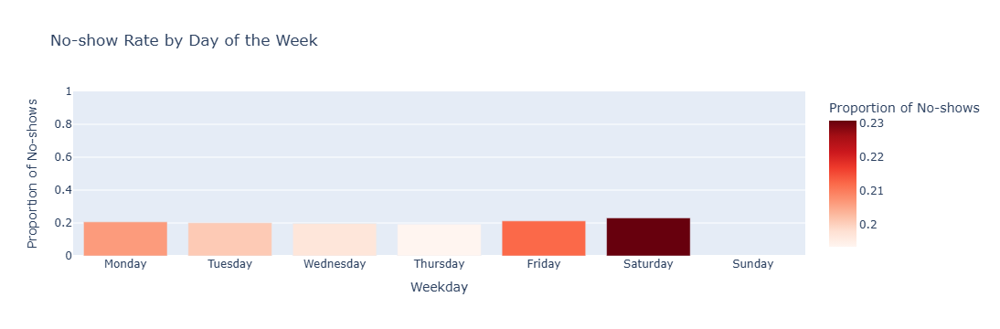
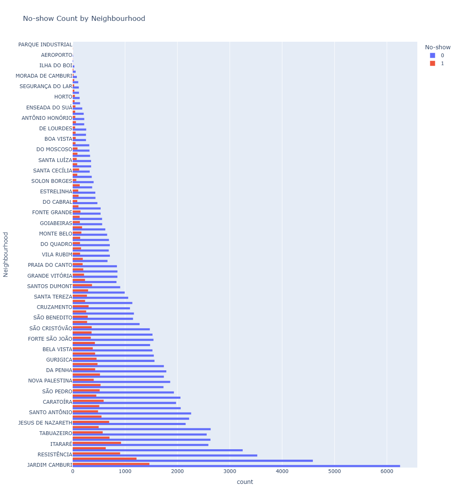

# 🏥 Project Title

***🏥 Healthcare Appointment No-Show Analysis***

## 📖 Project Overview

Missed medical appointments are a significant challenge for healthcare systems, leading to wasted resources, increased costs, and delayed treatments.

This project analyzes a dataset of **110,000+ hospital appointments in Brazil** to explore the factors that influence whether patients show up for their scheduled appointments.

By examining demographics, health conditions, communication methods, geography, and scheduling factors, this analysis aims to uncover actionable insights that can help hospitals reduce no-shows and improve patient care.

## ❓ Problem Statements

#### 1. Overall Trends

What percentage of patients miss their appointments?

#### 2. Demographics

Does age affect the likelihood of a no-show?

Are males or females more likely to miss appointments?

#### 3. Health Conditions

Do patients with hypertension, diabetes, alcoholism, or disabilities have higher or lower no-show rates?

#### 4. Communication

Do SMS reminders reduce the probability of a no-show?

#### 5. Geography

Are some neighbourhoods more prone to no-shows than others?

#### 6. Scheduling Factors

Does the waiting time (days between scheduling and appointment) influence no-shows?

#### 7. Socioeconomic Factors

Do patients on the scholarship program (social welfare) show different attendance patterns?

## 🛠️ Technologies Used

- #### Python

  - Numpy
  
  - Pandas
  
  - Matplotlib
  
  - Seaborn
  
  - Plotly
  
- #### Jupyter Notebook

## 📂 Project Structure

Project_Healthcare_Analysis/

│

├── dataset/ 

│   ├── raw/  # Raw dataset (original file)

│   └── cleaned/            # Cleaned dataset (processed for analysis)

│

├── notebooks/              # Jupyter notebooks with full analysis

│   └── healthcare_analysis.ipynb

│

├── visualizations/         # All saved charts and plots

│

└── README.md               # Project documentation (this file)

## 📊 Key Visuals

- 📌 No-show vs Show Pie Chart

- 📌 No-show Rates by Weekday

- 📌 No-show Count by Neighbourhood

## 🔑 Key Insights

**1. Overall No-show Rate: approx 20.19% of patients missed appointments.**

**2. Age: Younger adults (18-40) have slightly higher no-show rates.**

**3. Gender: Females/males show similar attendance, slight variation.**

**4. SMS reminders: Patients receiving SMS are less likely to miss appointments.**

**5. Weekday & Month: Mondays have highest no-shows, weekends lowest.**

**6. Neighborhood: Certain neighborhoods show higher no-show counts (top 20 highlighted).**

**7. Health Conditions: High-risk patients (Hypertension, Diabetes, Alcoholism, Handicap) have minorly higher no-show.**

**8. Scholarship: Patients on social welfare program show similar/no significant variation.**

## ✅ Recommendations

**1.Send SMS reminders to all patients systematically.**

**2.Focus on neighborhoods with high no-show rates.**

**3.Consider scheduling high-risk patients earlier in the week.**

**4.Use insights for hospital resource planning (staffing, equipment, appointment slots).**

## 📌 Conclusion

This analysis shows the main reasons why patients miss their appointments. Younger adults, certain weekdays, and some neighbourhoods have higher no-show rates. Receiving an SMS reminder helps patients show up. Health conditions and scholarship status do not affect attendance much.

By using these insights, hospitals can send SMS reminders, focus on high-risk neighbourhoods, and schedule patients more effectively to reduce missed appointments and improve patient care.

